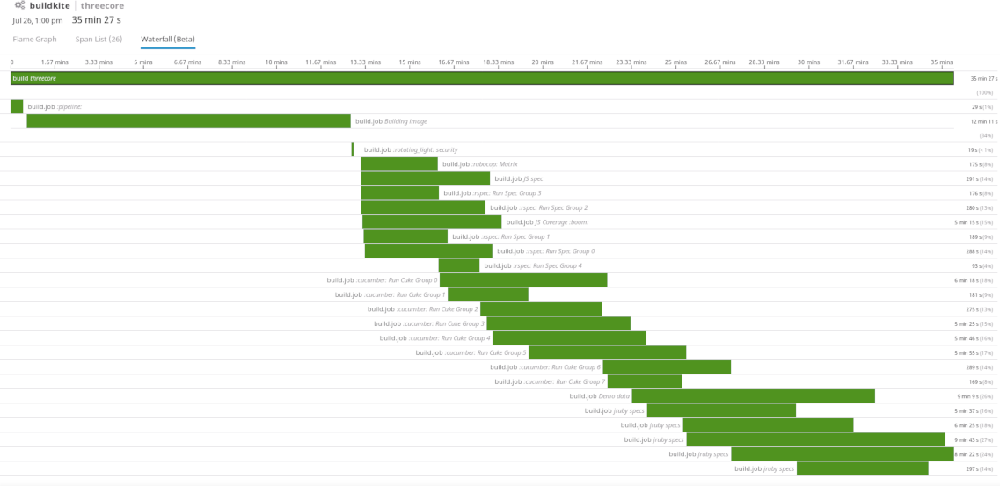
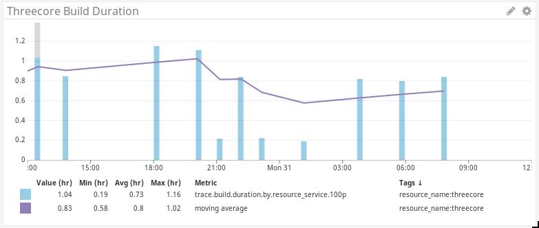

## buildkite-trace

A mini rack app that accepts buildkite webhooks and submits them to a datadog agent as traces.

The traces become available in the datadob web UI, and look something like this:

The spans in the trace also generate metrics that can be used in dashboards and monitors:

### Usage

Begin by adding buildkite-trace to your `Gemfile`.

    gem "buildite-trace"

Then create a `config.ru` file in the same directory, with the following content:

    require 'buildkite-trace'
    run Buildkite::Trace::App

Finally, run this:

    bundle exec rackup

### Deployment

The app should be deployed to a public webserver somewhere, with a domain name
and (ideally) TLS enabled.

Once deployed, use the web UI on buildkite.com to send webhooks to:

    https://yourdomain.example.com/events

In the webhook settings on buildkite.com, enable at least the following events:

* `build.finished`
* `job.finished`

The deployed service must have access to an instance of the datadog agent. Each
time it receives a webhook from buildkite, it'll translate it into trace data
that's sent to the datadog agent at `http://<dd-agent-ip>:8126/`

### Configuration

There is only one configurable value at this stage - the IP or hostname of the
datadog agent. To override the default (`127.0.0.1`) set the
`DATADOG_AGENT_HOST_IP` ENV var.

### Developing

I typically use docker to setup a consistent development. You can start a
development server like this:

    ./auto/start

... and post sample webhooks to it:

    curl -v --data @spec/fixtures/buildkite_job_finished.json http://127.0.0.1:9393/events
    curl -v --data @spec/fixtures/buildkite_build_finished.json http://127.0.0.1:9393/events

You'll need to have a datadog agent listening for traces on
http://127.0.0.1:8126, or you'll get a "Errno::ECONNREFUSED: Failed to open TCP
connection to 127.0.0.1:8126" exception.

To run the tests:

    ./auto/test
